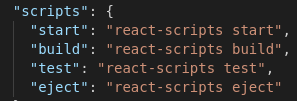
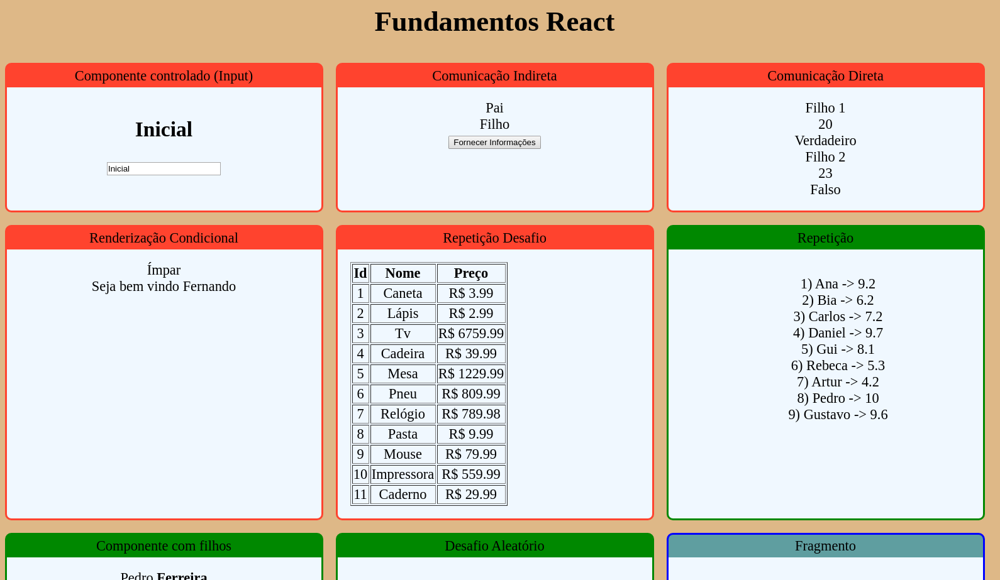

<h1>React Basics</h1>

Repositório destinado ao estudo de conceitos básicos do React.
    O conteúdo do repositório foi gerado a partir de curso online.

<h3>Algumas instruções</h3>

<b>1) Install react inside project folder:</b>

<code>npx create-react-app 'folder name' --use-npm</code>

<b>2) Iniciar o projeto quando baixado do github</b>

Devido ao arquivo original ter enviado o .gitignore é preciso
    baixar e instalar as dependências

<code>npm i</code>

<b>3) Rodar o app</b>

<code>npm start</code>

As possibilidades são as que se seguem na figura abaixo:

<h3>Aparência dos exercícios</h3>

OBS: para maiores informações de comandos verificar os links úteis
    ou então verificar o readme dentro do arquivo react-app.

